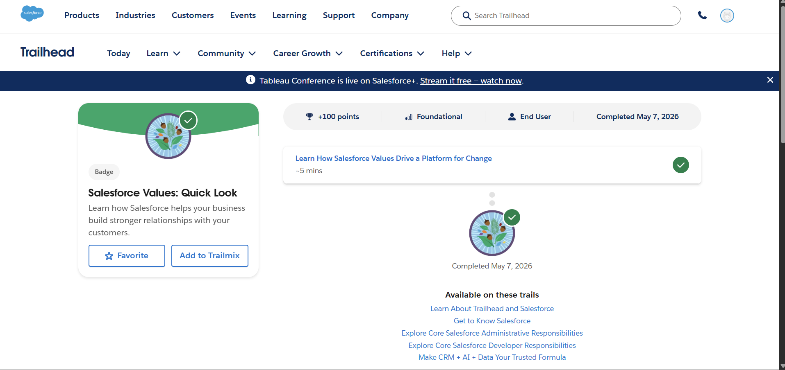
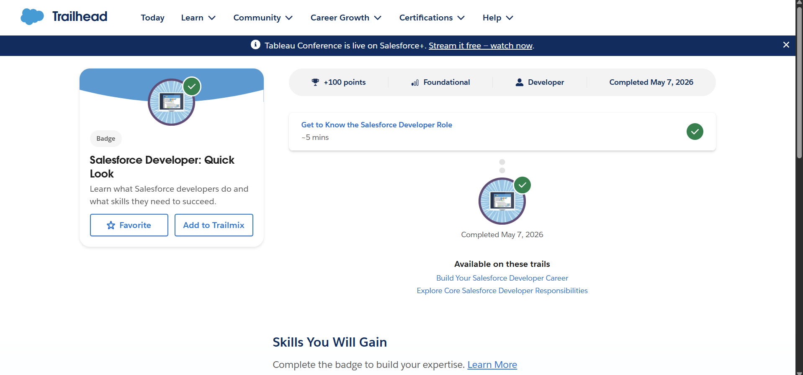
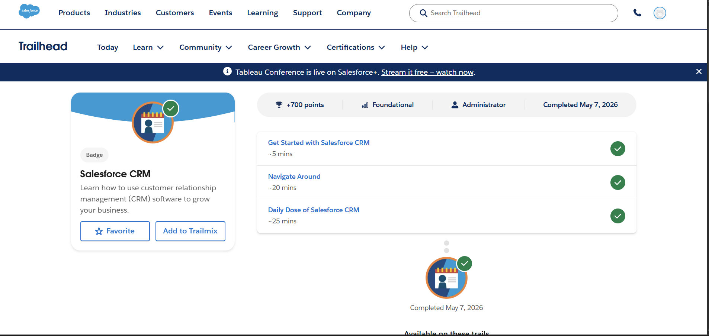
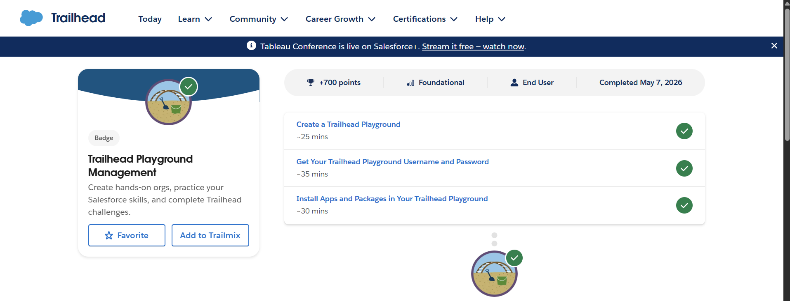

# Day 1 - Salesforce Basics

## What is CRM?
CRM (Customer Relationship Management) is a system used by companies to manage customers, sales, and business relationships.

## Why companies use Salesforce?
Companies use Salesforce to:
- Store customer data
- Track sales process
- Manage leads and opportunities
- Improve customer relationships

## Core Concepts

### Account
A company or organization.

### Contact
A person related to that company.

### Lead
A potential customer (initial inquiry).

### Opportunity
A possible sales deal or conversion chance.

## Business Flow
Lead → Contact → Opportunity → Customer

## Real Life Mapping (College Admission Example)
- Account = College
- Contact = Student/Parent
- Lead = Admission inquiry
- Opportunity = Admission process

## Trailhead Work Completed
- Salesforce Values Quick Look
- Salesforce Developer Quick Look
- Salesforce CRM Module
- Trailhead Playground Setup

## Screenshots

