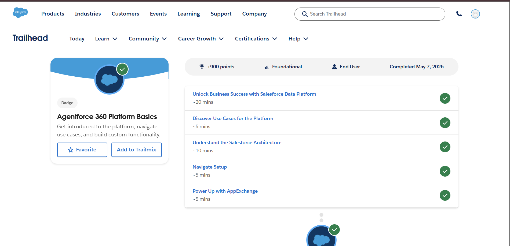
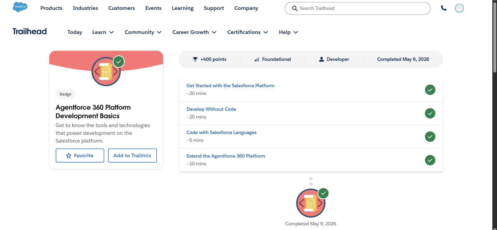

# Day 2 - Salesforce Platform Basics

## What is Salesforce Platform?
Salesforce Platform is a cloud-based environment used to build, customize, and manage business applications such as CRM systems.

## Core Concepts
### App
An App is a collection of tabs, objects, and features grouped together for a specific purpose.
Example: Sales App, Service App.

### Object
An Object is like a database table that stores information.
Examples:
- Account
- Contact
- Opportunity

### Tab
A Tab is used to access objects and features from the user interface.
Example:
Account Tab opens Account records.

## CRM + Platform Connection
CRM concepts like Account, Contact, and Opportunity are stored as Salesforce Objects inside Apps.
Example:
- Account = Company information
- Contact = Customer information
- Opportunity = Sales deal

## Configuration vs Coding
### Configuration (No Code)
Used when requirements are simple.
Examples:
- Creating custom fields
- Page layouts

### Coding (Apex)
Used when business logic is complex.
Examples:
- Custom automation
- API integrations

## Real System Design (College Admission System)
### App Name
College Admission App
### Objects
- Student
- Admission
- Department
- Faculty

### User Interaction
Users can:
- Add student details
- Track admissions
- Manage departments

## Trailhead Work Completed
- Agentforce 360 Platform Basics
- Agentforce 360 Platform Development Basics

## Screenshots

