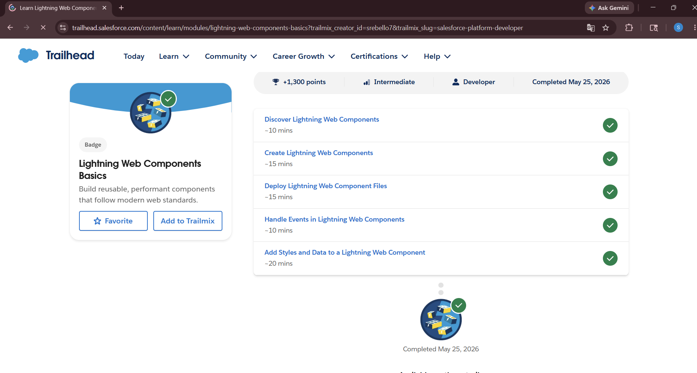
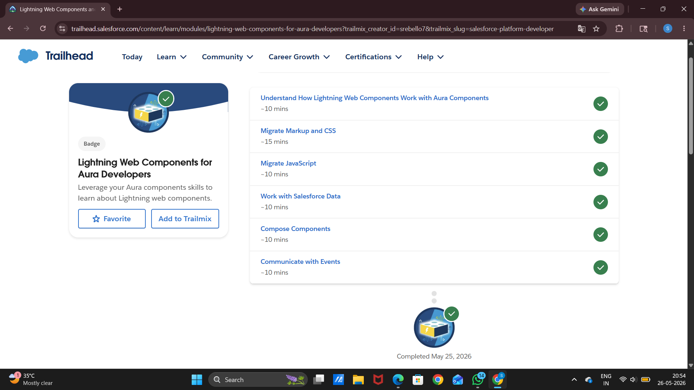
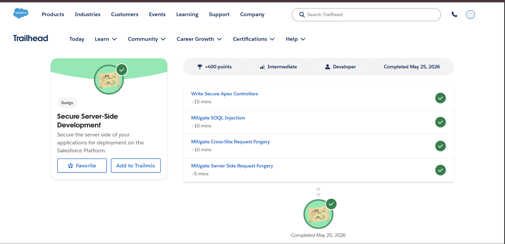

# Day 8 - Lightning Web Components (LWC)

## What is LWC?

Lightning Web Components (LWC) is a modern Salesforce UI framework used to build fast and reusable user interface components.

LWC uses:
- HTML
- JavaScript
- CSS
- Metadata XML

It helps developers create modern enterprise applications.

---

## Why Salesforce Uses LWC

Salesforce uses LWC because:
- It is faster and lightweight
- Uses modern web standards
- Supports reusable components
- Improves performance
- Makes UI development easier

LWC replaced older Aura components for better performance and maintainability.

---

# UI Thinking Exercise

## UI Screens for College Management System

### 1. Student Registration Form
Used for new student enrollment.

### 2. Course Dashboard
Displays course details and seat availability.

### 3. Attendance View
Shows student attendance records.

### 4. Faculty Panel
Allows faculty to manage students and courses.

### 5. Notifications Widget
Displays important announcements and alerts.

---

# Component Thinking

## Selected Screen
Student Dashboard

## Reusable Components

### 1. Header Component
Displays college logo and navigation menu.

### 2. Student Info Component
Shows student details.

### 3. Attendance Component
Displays attendance percentage.

### 4. Notification Component
Shows alerts and announcements.

### 5. Course Component
Displays enrolled courses.

---

## Why Reusable Components Are Useful

Reusable components:
- Reduce duplicate work
- Improve maintainability
- Increase development speed
- Keep UI consistent
- Simplify updates

---

# Frontend vs Backend Thinking

## Frontend / UI Logic

Handled in UI:
- Button clicks
- Form input
- Notification display
- Page navigation

Frontend focuses on user interaction and display.

---

## Backend / Apex Logic

Handled in Backend:
- Database operations
- Fee calculation
- Complex validation
- Business rules
- Record updates

Backend focuses on business logic and data processing.

---

# Reflection

Modern enterprise systems use component-based UI architecture because:
- Applications become modular
- Components can be reused
- Maintenance becomes easier
- Teams can work efficiently
- UI stays consistent across system

Component-based design improves scalability and development speed.

---

# Revision Questions

## 1. What is a component?
A component is a reusable part of a user interface.

## 2. Why are reusable components useful?
They reduce duplicate work and improve maintainability.

## 3. Difference between frontend and backend?
- Frontend handles UI and user interaction.
- Backend handles business logic and data processing.

## 4. Why did Salesforce move toward LWC?
To improve performance and use modern web technologies.

## 5. Why is UI important in enterprise systems?
Good UI improves user experience and productivity.

## 6. Why should systems separate UI and business logic?
It improves scalability, maintenance, and security.

## 7. What security risks exist in enterprise applications?
Unauthorized access, data leaks, and insecure permissions.

## 8. Why should developers think modularly?
Modular design makes systems easier to manage and reuse.

---

# Trailhead Work Completed
- Lightning Web Components Basics
- Lightning Web Components for Aura Developers
- Secure Server-Side Development
- Search Solution Basics

---

# Screenshots

